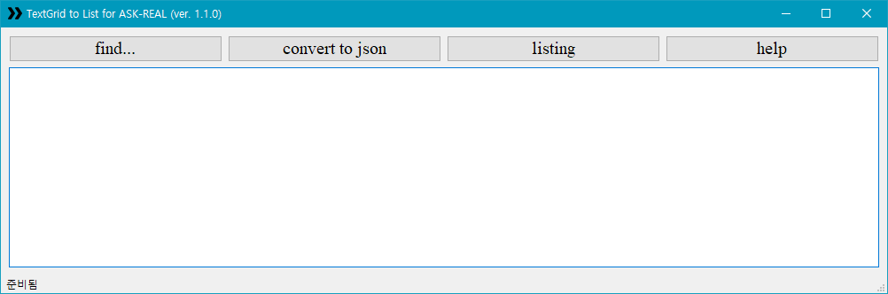
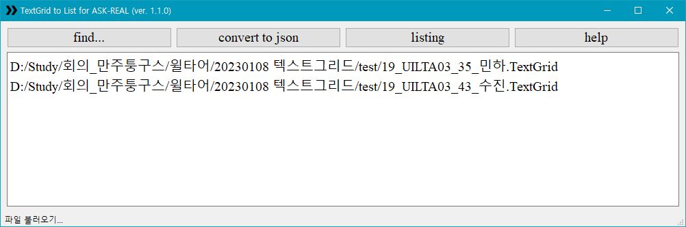
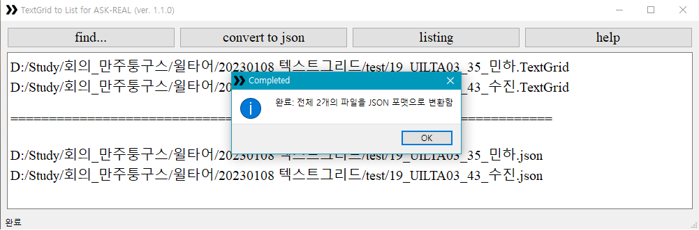
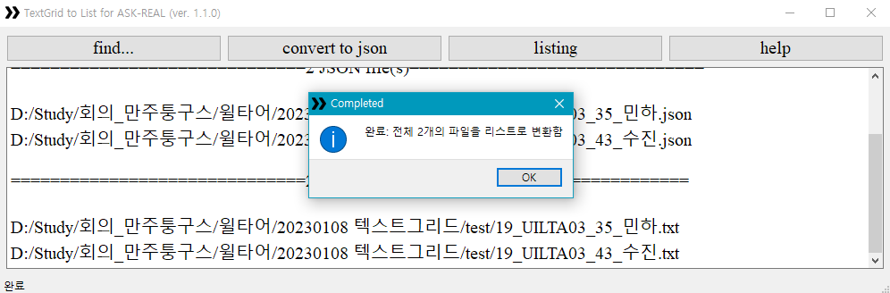

# 역사비교언어학 프로그램 프로젝트 - TGtoLIST
|작성자|문의 이메일|라이센스|
|:---:|:---:|:---:|
|강민하|alsgk1123@gmail.com|MIT License|

- 텍스트그리드 파일을 JSON 형식 및 간편한 리스트 보기로 변환하는 프로그램입니다.

## 1. 업데이트 내역
### 1) 윈도우즈
|업데이트일|버전명|업데이트 내역|
|:-------:|:---:|:----------|
|20230109|ver. 1.1.0|배포|
|20230109|ver. 1.0.0|Initial Commit|

### 2) 맥OS
- 개발 계획 미정

## 2. 사용 방법
### 1) 프로그램 다운로드
- 깃허브 레포지토리 우측 상단의 'Code'를 클릭 후 'Download ZIP'을 클릭하면 됩니다.
- 물론 레포지토리를 바로 클론하셔도 무방합니다.

### 2) 구성
다운로드된/클론된 폴더는 다음과 같이 구성되어 있습니다.

- **TGtoLIST.exe**: 프로그램의 본체입니다. [H-side](https://github.com/SeHaan/program_H-side)와는 달리 해당 파일을 컴퓨터 저장소 어디에나 두어도 실행이 가능합니다.
- img 폴더: 아이콘 및 설명용 사진이 들어 있는 폴더입니다.
- main.py, utils.py: TOtoLIST.exe를 구성하는 소스코드입니다. 삭제하셔도 무방하고, 분석을 위해 남겨두셔도 좋습니다.
- README.md, README.html: 도움말 파일입니다.
- LICENSE: 라이센스 파일입니다. 해당 프로그램은 **MIT LICENSE**를 준수합니다.
  
### 3) 실행
#### 가. 윈도우즈
- 클론된 폴더 또는 다운로드해서 압축을 해제한 폴더에서 **TGtoLIST.exe**를 꺼내서 실행합니다.

#### 나. 맥OS
- (추후 작성 예정)
  
#### 다. 나는 내가 직접 빌드해서 사용하겠다.
- 물론 **소스코드(main.py, utils.py)를 직접 빌드**해서 사용해도 됩니다. 빌드하기 전에, 컴퓨터에 아래 버전의 Python과 그 라이브러리가 설치되어 있는지 확인해주세요.

    |Module|version|
    |:---------:|:-----:|
    |pyinstaller|5.7|
    |PyQt5|5.15.7|

- 터미널에서  이 폴더의 경로까지 들어오신 다음 아래의 명령어를 입력해주세요.
    ```cmd
    pyinstaller -F -w -i=img/icon.ico -n=TGtoLIST --add-data="./img/*;./img" main.py
    ```

### 4) 기본 구성
TGtoLIST.exe를 실행하면 아래와 같은 화면을 볼 수 있습니다.



- **find...**: JSON 형식 또는 ASK REAL의 리스트 형식으로 바꾸고 싶은 파일을 찾습니다. 여러 개를 한번에 선택할 수 있습니다. 파일을 선택하고 "열기"를 누르면 아래의 공간에 열어둔 파일의 절대 경로(들)이 나타납니다.
- **convert to json**: Praat의 TextGrid 형식은 데이터를 직접 다루기에는 불편한 구조입니다. 그래서 이를 JSON 형식으로 먼저 변환합니다. 이때, 열려 있는 파일의 확장자가 '.TextGrid'가 아니면 오류를 반환합니다.
- **listing**: json 형식으로 바뀐 파일을 ASK REAL에서 정한 리스트로 바꿉니다.
  - json 파일을 선택해서 열어야 제대로 작동합니다.
  - TextGrid 파일로 'convert to json'을 하고 그대로 둔 상태라면 바로 이어서 listing을 눌러도 작동하도록 설계했습니다.
  - 처음부터 TextGrid 파일을 연 채 'listing'을 바로 눌러도, 해당 TextGrid와 동일한 이름의 JSON 파일이 존재한다면 해당 JSON 파일을 listing된 파일로 바꿉니다.
  - 그러나 위의 경우들에 해당하지 않는다면 오류를 반환합니다.
  - listing의 결과물로 저장되는 파일은 일반 텍스트 파일(.txt)입니다. 해당 파일을 엑셀에서 불러와서 csv 파일이나 엑셀 파일로 저장할 수 있습니다.
- **help**: 도움말 페이지로 연결합니다. 이 사이트로 연결됩니다.

## 3. 실행 예제
- **find...**를 눌러 파일을 불러옵니다.



- 다음으로 **convert to json**을 눌러 해당 파일들을 json 형식으로 먼저 바꿉니다.



- 마지막으로 **listing**을 눌러 ASK REAL의 리스트 형식으로 바꿉니다.

